# TodoFlow Application - Mermaid Diagrams

## 1. High-Level Architecture

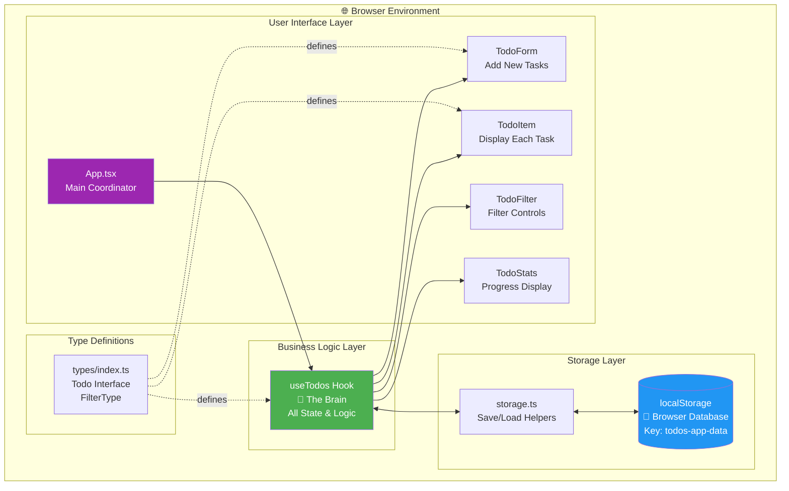

## 2. Complete Data Flow - Adding a Todo

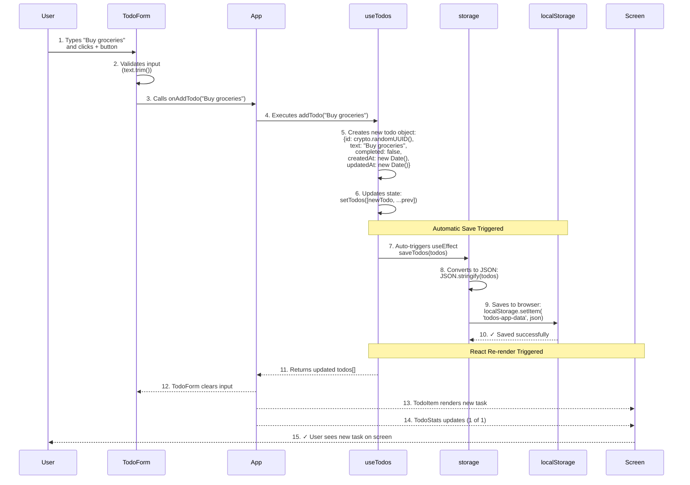

## 3. Complete Data Flow - Toggling Todo (Mark Complete)

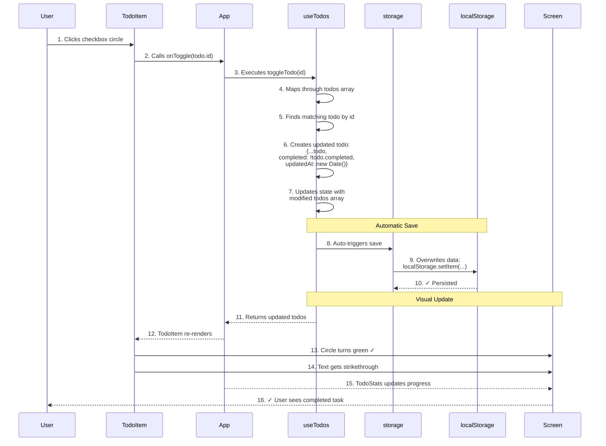

## 4. Complete Data Flow - Filtering Todos

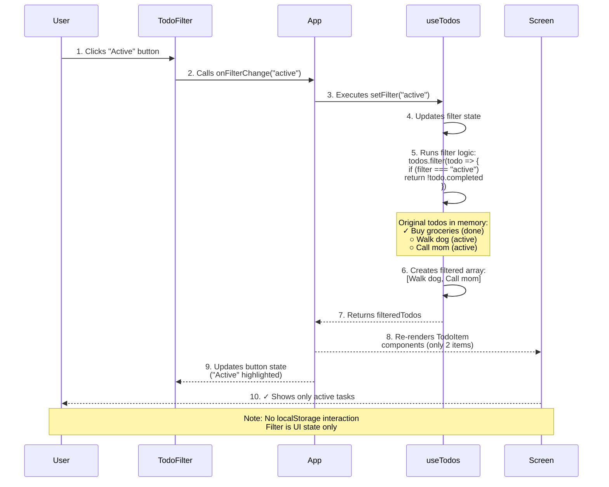

## 5. Application Startup - Loading Data

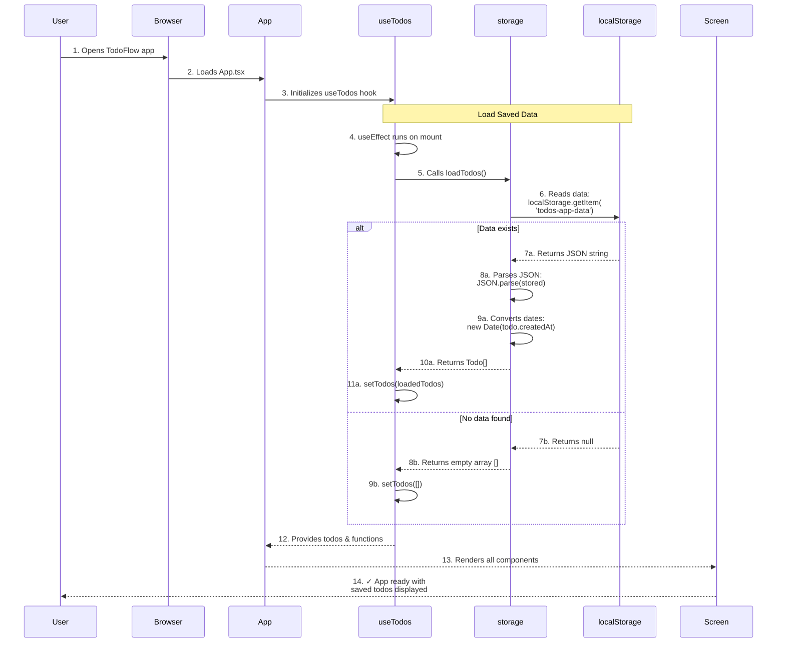

## 6. localStorage Database Schema

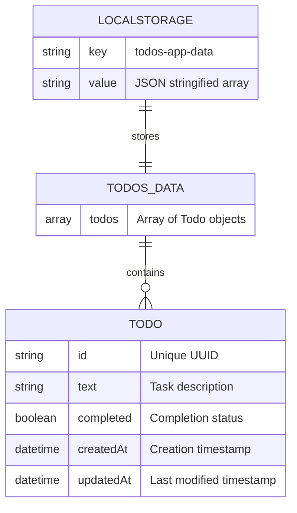

## 7. Component Hierarchy & Data Flow

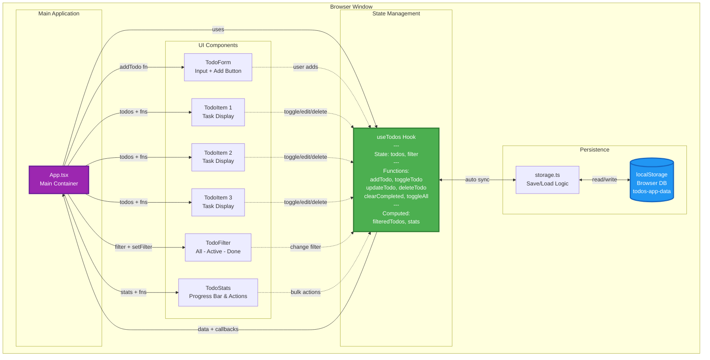

## 8. State Management Flow

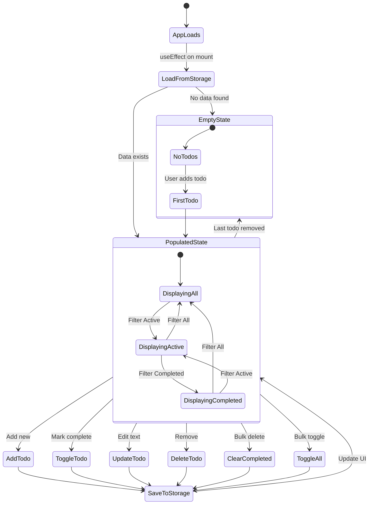

## 9. User Interaction Flow Map

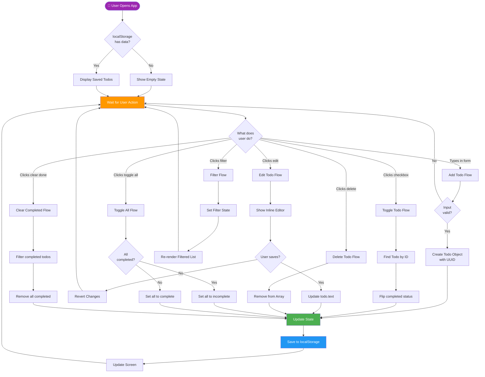

## 10. localStorage Interaction Details

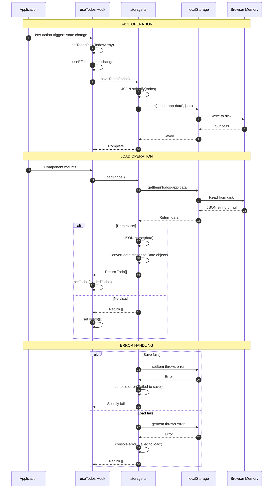

## 11. Todo Object Lifecycle

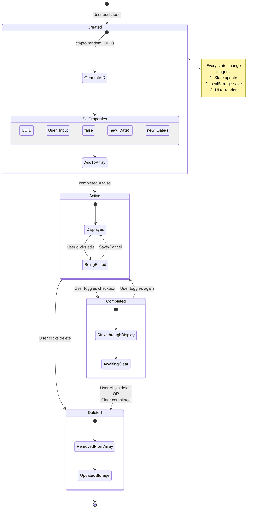

## 12. Complete System Overview

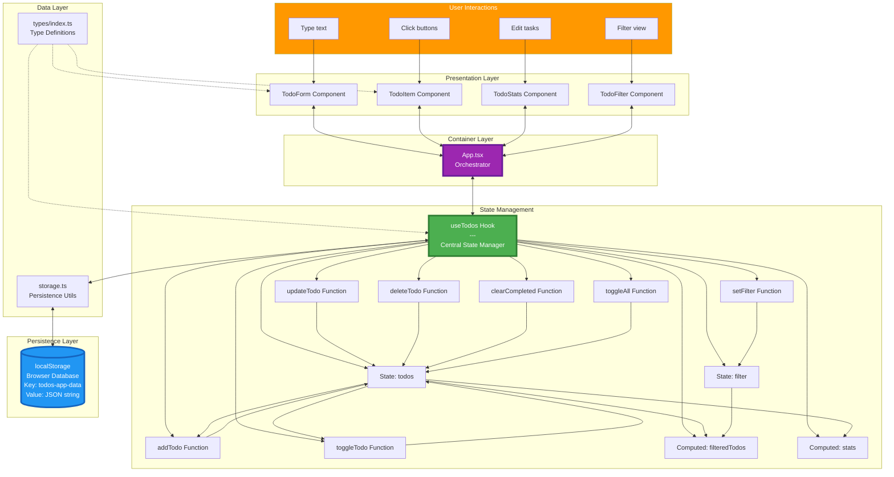

## Summary

These diagrams show:

1. **Architecture** - How all files are organized
2. **Add Todo Flow** - Complete sequence from user input to screen update
3. **Toggle Todo Flow** - How checking off items works
4. **Filter Flow** - How filtering doesn't affect storage
5. **Startup Flow** - How data loads from localStorage
6. **Database Schema** - What's stored in localStorage
7. **Component Hierarchy** - Who talks to whom
8. **State Management** - Different states of the app
9. **User Interaction Map** - All possible user actions
10. **localStorage Details** - Save/Load operations in detail
11. **Todo Lifecycle** - Birth to death of a todo item
12. **Complete System** - Everything together

Key Insights:
- **useTodos Hook** is the single source of truth (the brain)
- **localStorage** is the only database (automatic sync)
- **Components** are "dumb" - they just display and trigger actions
- **Every state change** automatically saves to localStorage
- **Filter is UI-only** - doesn't affect stored data
